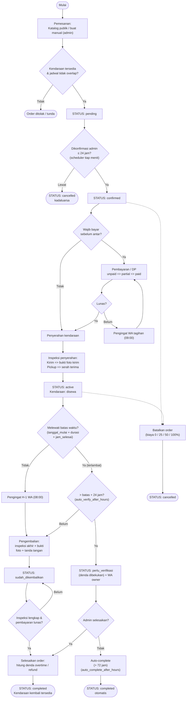

# Flowchart — Alur Order (UDIN RENCTCAR)

Diagram alur lengkap order dari pemesanan hingga penyelesaian/pembatalan,
termasuk titik-titik keputusan dan otomasi sistem.

## Catatan Alur

- **Kadaluarsa pending**: scheduler `OrderExpirePending` tiap menit; pending yang
  jadwal mulainya lewat > `pending_expire_hours` (default 24 jam) → `cancelled`.
- **Freeze terlambat**: scheduler `OrderVerifyOverdue` tiap 15 menit; order `active`
  lewat batas + > `auto_verify_after_hours` (default 24 jam) → `perlu_verifikasi`
  (denda dibekukan, WA ke owner).
- **Auto-complete**: `perlu_verifikasi` menunggu > `auto_complete_after_hours`
  (default 72 jam) → `completed` otomatis.
- **Pembatalan**: biaya 0% (> 7 hari), 25% (3–7 hari), 50% (1–3 hari), 100% (hari H/aktif).
- **Batas waktu kembali**: `tanggal_mulai + durasi_hari + jam_selesai` (bukan dari
  `tanggal_selesai`).