# Use Case Diagram — Alur Order (UDIN RENCTCAR)

Dokumen ini menggambarkan alur order dari pemesanan hingga penyelesaian, termasuk
otomasi sistem. Status order: `pending → confirmed → active → perlu_verifikasi → completed`
(atau `cancelled`).

## Diagram

```mermaid
flowchart TB
    subgraph A["Pesan & Order"]
        UC1["Pesan Kendaraan via Katalog"]
        UC2["Buat Order Manual"]
        UC3["Konfirmasi Order<br/>(pending → confirmed)"]
        UC4["Cek Ketersediaan & Overlap Jadwal"]
        UC7["Batalkan Order"]
        UC9["Kadaluarsakan Order Pending<br/>(> 24 jam → cancelled)"]
    end

    subgraph B["Pembayaran"]
        UC5["Verifikasi Pembayaran / DP"]
        UC6["Pengingat Tagihan WA<br/>(confirmed/active belum lunas)"]
    end

    subgraph C["Penyerahan & Inspeksi"]
        UC10["Lihat Tugas Inspeksi"]
        UC11["Isi Inspeksi Penyerahan<br/>(pickup / kirim)"]
        UC12["Isi Inspeksi Pengembalian<br/>(return / kembali)"]
        UC13["Unggah Bukti Foto<br/>(pengiriman & pengembalian)"]
    end

    subgraph D["Penyelesaian"]
        UC14["Selesaikan Order<br/>(completed)"]
        UC15["Hitung Denda Overtime<br/>& Pengembalian Awal (refund)"]
        UC16["Bekukan Order Terlambat<br/>(> 24 jam → perlu_verifikasi)"]
        UC17["Auto-complete Order<br/>perlu_verifikasi (> 72 jam)"]
        UC18["Pengingat H-1 &<br/>Verifikasi WA"]
    end

    Pemesan["Pemesan (Customer)"] --> UC1
    Petugas["Petugas / Operator"] --> UC10
    Petugas --> UC11
    Petugas --> UC12
    Petugas --> UC13
    Admin["Admin Utama & Admin Operasional"] --> UC2
    Admin --> UC3
    Admin --> UC5
    Admin --> UC14
    Admin --> UC7
    Sistem["Sistem (Scheduler)"] --> UC9
    Sistem --> UC16
    Sistem --> UC17
    Sistem --> UC6
    Sistem --> UC18

    UC1 -. include .-> UC4
    UC2 -. include .-> UC4
    UC11 -. include .-> UC4
    UC14 -. include .-> UC12
    UC14 -. include .-> UC5
    UC14 -. include .-> UC15
    UC7 -. include .-> UC15
    UC16 -. include .-> UC15
```

## Aktor

| Aktor | Peran |
|---|---|
| **Pemesan (Customer)** | Memesan kendaraan melalui katalog publik (`POST /katalog/orders`). Order masuk berstatus `pending`. |
| **Petugas / Operator** | Mengerjakan tugas inspeksi pickup/return, mengunggah bukti foto, menandatangani serah terima bersama pelanggan. |
| **Admin Utama & Admin Operasional** | Membuat order manual, konfirmasi order, verifikasi pembayaran, menyelesaikan/membatalkan order, mengelola kendaraan beserta statusnya (tersedia/servis/tidak tersedia). |
| **Sistem (Scheduler)** | Menjalankan otomasi order (lihat tabel di bawah). |

## Detail Use Case

| # | Use Case | Keterangan |
|---|---|---|
| UC1 | Pesan Kendaraan via Katalog | Publik; customer dibuat otomatis dari nomor HP; cek overlap datetime-aware; notifikasi WA owner. |
| UC2 | Buat Order Manual | Via admin; langsung `confirmed`; cek kendaraan `tersedia` + overlap. |
| UC3 | Konfirmasi Order | `pending → confirmed`; mengaktifkan kendaraan untuk booking tanggal terkait. |
| UC4 | Cek Ketersediaan & Overlap | Include dari UC1/UC2/UC11; kendaraan `disewa`/`servis`/`tidak tersedia` tidak bisa dipesan. |
| UC5 | Verifikasi Pembayaran / DP | `unpaid → partial → paid`; gate `wajib_bayar_sebelum_antar` jika diaktifkan. |
| UC6 | Pengingat Tagihan WA | Harian 09:00 untuk `confirmed`/`active` yang belum lunas. |
| UC7 | Batalkan Order | Hitung biaya pembatalan: gratis (>7 hari), 25% (3–7 hari), 50% (1–3 hari), 100% (hari H/aktif). |
| UC9 | Kadaluarsakan Order Pending | Tiap menit; pending yang jadwal mulainya lewat > `pending_expire_hours` (default 24 jam) → `cancelled`. Belum dikonfirmasi = bukan salah customer: semua bayaran dikembalikan penuh (refund) + WA pemberitahuan. |
| UC9b | Batalkan Order Confirmed Tidak Diambil | Tiap menit (`OrderCancelNoPickup`); confirmed yang lewat jam mulai > `confirmed_no_pickup_expire_hours` (default 24 jam) tanpa inspeksi pickup → `cancelled`. Sudah dikonfirmasi tapi tidak diambil = biaya pembatalan 100% (sama seperti manual): DP hangus, tanpa refund + WA pemberitahuan. |
| UC10 | Lihat Tugas Inspeksi | Halaman `/inspeksi`; tugas `pickup`/`return` + notifikasi WA ke petugas. |
| UC11 | Isi Inspeksi Penyerahan | `kirim`: simpan inspeksi awal → order `active`, kendaraan `disewa`. |
| UC12 | Isi Inspeksi Pengembalian | `kembali`: inspeksi akhir + tanda tangan → `status_pengiriman=sudah_dikembalikan`; wajib ada sebelum order di-complete. |
| UC13 | Unggah Bukti Foto | Opsional: foto kondisi kendaraan per kategori (Body, Interior, Ban, AC, Lampu) saat inspeksi; bukti foto pengiriman (saat antar) & bukti foto pengembalian (saat selesai) boleh dilampirkan tetapi tidak wajib. |
| UC14 | Selesaikan Order | Wajib: inspeksi return lengkap + pembayaran lunas + bukti pengembalian; kendaraan kembali `tersedia` (tetap `tidak_tersedia` jika memang demikian sebelumnya). |
| UC15 | Hitung Denda Overtime | Denda = jam terlambat × rate (settings), batas = `tanggal_selesai @ jam_selesai`. Pengembalian lebih awal TIDAK menghasilkan refund: tagihan tetap sesuai kesepakatan (durasi penuh), hanya dicatat di catatan order. |
| UC16 | Bekukan Order Terlambat | Tiap 15 menit; `active` lewat batas + > `auto_verify_after_hours` (default 24 jam) → `perlu_verifikasi` (denda dibekukan, WA owner). |
| UC17 | Auto-complete | `perlu_verifikasi` menunggu > `auto_complete_after_hours` (default 72 jam) → `completed` otomatis. |
| UC18 | Pengingat H-1 & Verifikasi | Harian: pengingat pengembalian H-1 (08:00) dan pengingat verifikasi untuk `perlu_verifikasi` (09:00). |

## Otomasi Scheduler

| Command | Jadwal | Tindakan |
|---|---|---|
| `OrderExpirePending` | tiap menit | pending kadaluarsa → `cancelled` + refund penuh + WA customer |
| `OrderCancelNoPickup` | tiap menit | confirmed tidak diambil > 24 jam → `cancelled` + DP hangus + WA customer |
| `OrderVerifyOverdue` | tiap 15 menit | active terlambat → `perlu_verifikasi`; lalu auto-complete |
| `OrderReminderH1` | 08:00 harian | WA pengingat pengembalian H-1 |
| `OrderReminderPayment` | 09:00 harian | WA tagihan unpaid/partial |
| `OrderReminderVerifikasi` | 09:00 harian | WA owner untuk `perlu_verifikasi` |